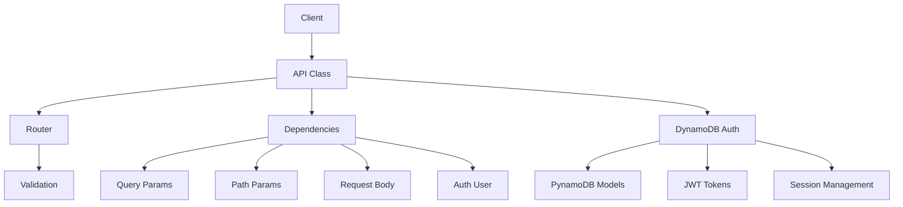

# LambAPI Documentation

AWS Lambda 用のモダンな Web API フレームワーク

## 📁 ドキュメント構成

```
docs/
├── README.md                    # このファイル
├── quickstart.md               # クイックスタート
├── core/                       # コア機能
│   ├── api.md                  # API クラス
│   ├── routing.md              # ルーティング
│   ├── dependencies.md         # 依存性注入
│   └── validation.md           # バリデーション
├── auth/                       # 認証機能
│   ├── overview.md             # 認証概要
│   └── dynamodb.md             # DynamoDB 認証
├── guides/                     # 実践ガイド
│   ├── deployment.md           # デプロイ
│   ├── cors.md                 # CORS 設定
│   └── error-handling.md       # エラーハンドリング
├── examples/                   # サンプルコード
│   ├── basic-api.md            # 基本 API
│   ├── authentication.md       # 認証付き API
│   └── advanced.md             # 高度な使用例
└── api-reference/              # API リファレンス
    ├── classes.md              # クラス一覧
    ├── functions.md            # 関数一覧
    └── exceptions.md           # 例外一覧
```

## 🚀 今すぐ始める

- [クイックスタート](quickstart.md) - 5分で始める lambapi
- [基本 API の作成](examples/basic-api.md) - 最初の API を作成
- [認証機能の追加](examples/authentication.md) - セキュアな API の構築

## 📚 コア機能

- [API クラス](core/api.md) - フレームワークの中心
- [ルーティング](core/routing.md) - URL ルーティング機能
- [依存性注入](core/dependencies.md) - 型安全なパラメータ処理
- [バリデーション](core/validation.md) - 自動データ検証

## 🔐 認証

- [認証概要](auth/overview.md) - 認証システムの基本
- [DynamoDB 認証](auth/dynamodb.md) - PynamoDB を使った認証

## 📖 実践ガイド

- [デプロイ](guides/deployment.md) - AWS Lambda へのデプロイ
- [CORS 設定](guides/cors.md) - クロスオリジン対応
- [エラーハンドリング](guides/error-handling.md) - エラー処理

## 🏗️ アーキテクチャ



## 💡 サポート

質問や issue は [GitHub リポジトリ](https://github.com/sskyh0208/lambapi) へお寄せください。