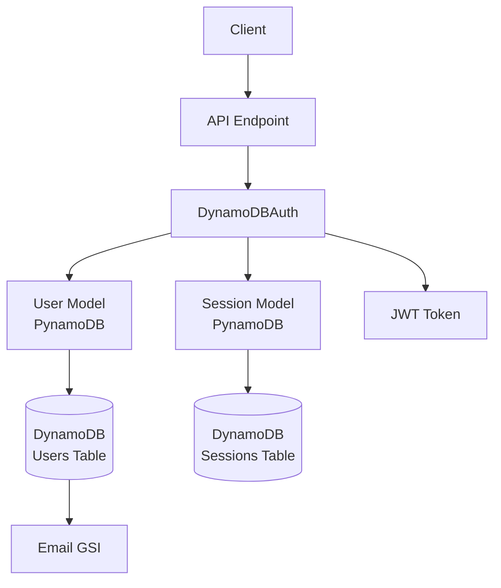
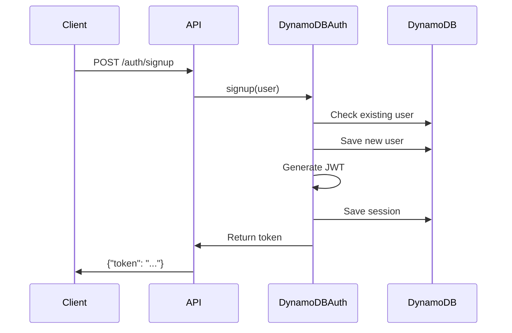
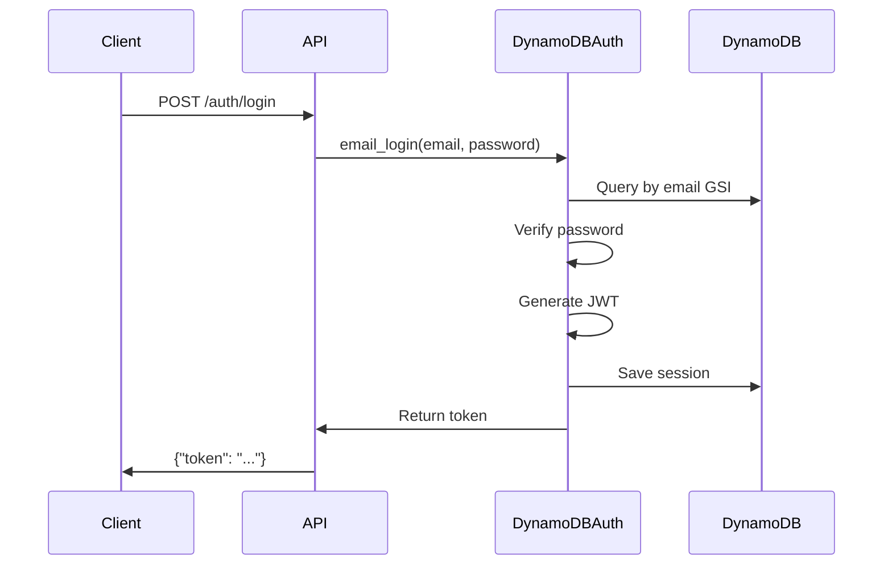
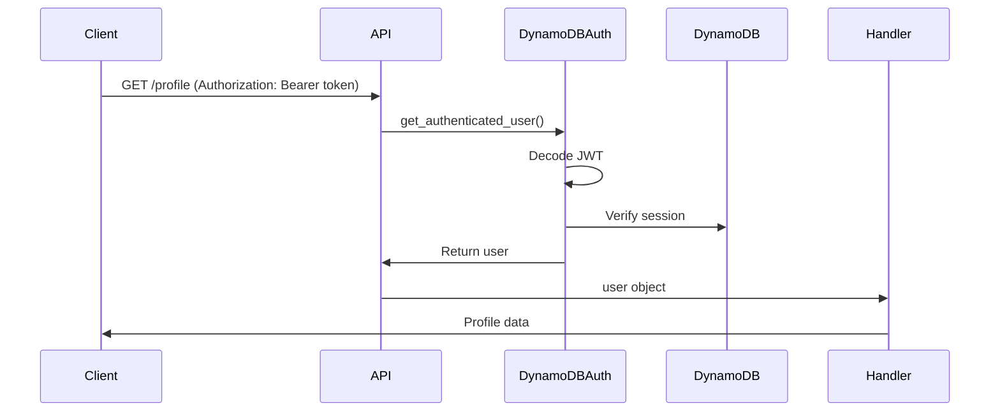

# 認証システム概要

lambapi の認証システムは DynamoDB + JWT + セッション管理による堅牢でスケーラブルなソリューションです。

## 🏗️ アーキテクチャ



## 🚀 特徴

- **JWT トークン認証**: セキュアなトークンベース認証
- **PynamoDB 統合**: 型安全な ORM 統合  
- **セッション管理**: 独立したセッションモデルによる永続管理
- **email ログイン**: GSI による高速メール検索（`is_email_login=True`で有効化）
- **ロールベース認証**: 細かいアクセス制御
- **パスワード暗号化**: bcrypt による安全なハッシュ化
- **カスタムトークン**: JWT ペイロードのフィールド自由設定

## 📦 インストール

```bash
# 認証機能込みでインストール
pip install lambapi[auth]

# 必要な依存関係
# - pynamodb>=5.4.0 - DynamoDB ORM
# - PyJWT>=2.8.0 - JWT トークン処理  
# - bcrypt>=4.0.0 - パスワードハッシュ化
# - cryptography>=41.0.0 - 暗号化サポート
```

## 🔧 基本セットアップ

### 1. PynamoDB モデル定義

```python
from pynamodb.models import Model
from pynamodb.attributes import (
    UnicodeAttribute, BooleanAttribute, UTCDateTimeAttribute, NumberAttribute
)
from pynamodb.indexes import GlobalSecondaryIndex, AllProjection

# Email 検索用の GSI
class EmailIndex(GlobalSecondaryIndex):
    class Meta:
        index_name = 'email-index'
        projection = AllProjection()
        read_capacity_units = 1
        write_capacity_units = 1
    
    email = UnicodeAttribute(hash_key=True)

# ユーザーモデル
class User(Model):
    class Meta:
        table_name = "users"
        region = "us-east-1"
    
    id = UnicodeAttribute(hash_key=True)
    password = UnicodeAttribute()
    email = UnicodeAttribute()
    email_index = EmailIndex()  # email ログイン用（is_email_login=True の場合に必須）
    name = UnicodeAttribute()
    role = UnicodeAttribute(default="user")
    is_active = BooleanAttribute(default=True)
    created_at = UTCDateTimeAttribute(null=True)

# セッションモデル  
class UserSession(Model):
    class Meta:
        table_name = "user_sessions"
        region = "us-east-1"
    
    id = UnicodeAttribute(hash_key=True)
    user_id = UnicodeAttribute()
    token = UnicodeAttribute()
    expires_at = NumberAttribute()  # Unix timestamp
    ttl = NumberAttribute()  # DynamoDB TTL
```

### 2. DynamoDBAuth 初期化

```python
from lambapi.auth import DynamoDBAuth

auth = DynamoDBAuth(
    user_model=User,
    session_model=UserSession,
    secret_key="your-secure-secret-key",
    expiration=3600,  # 1時間
    is_email_login=True,  # email ログインを有効化（auth.email_login()が使用可能になる）
    is_role_permission=True,
    token_include_fields=["id", "email", "name", "role", "is_active"],
    password_min_length=8,
    password_require_digit=True
)
```

### 3. 認証エンドポイント

```python
from lambapi import API, Body, Authenticated

@app.post("/auth/signup")
def signup(data: dict = Body(...)):
    user = User(
        id=data["email"],
        password=data["password"],
        email=data["email"],
        name=data["name"]
    )
    token = auth.signup(user)
    return {"token": token}

@app.post("/auth/login") 
def login(data: dict = Body(...)):
    # is_email_login=True の場合のみ使用可能
    token = auth.email_login(data["email"], data["password"])
    return {"token": token}

# ID ログインも利用可能（is_email_login の設定に関係なく使用可能）
@app.post("/auth/id-login")
def id_login(data: dict = Body(...)):
    token = auth.login(data["user_id"], data["password"])
    return {"token": token}

@app.post("/auth/logout")
def logout(user: User = Authenticated(...)):
    auth.logout(user)
    return {"message": "ログアウトしました"}

@app.get("/profile")
@auth.require_role("user")
def get_profile(user: User = Authenticated(...)):
    return {"profile": user.to_dict()}
```

## 🔐 認証フロー

### 1. ユーザー登録



### 2. ログイン



### 3. 認証済みリクエスト



## 🛡️ セキュリティ機能

### パスワード保護

- **bcrypt ハッシュ化**: ソルト付きハッシュで保存
- **設定可能な要件**: 文字数、文字種別の制限
- **安全なデフォルト**: 最小8文字、数字必須

```python
auth = DynamoDBAuth(
    # ... other params
    password_min_length=8,
    password_require_uppercase=False,
    password_require_lowercase=False, 
    password_require_digit=True,
    password_require_special=False
)
```

### トークンセキュリティ

- **JWT 署名**: HMAC-SHA256 で署名
- **有効期限**: 設定可能なトークン有効期限
- **セッション検証**: JWT とセッション両方をチェック

### 推奨セキュリティ設定

```python
import os

auth = DynamoDBAuth(
    user_model=User,
    session_model=UserSession,
    secret_key=os.environ["JWT_SECRET_KEY"],  # 環境変数を使用
    expiration=3600,  # 短い有効期限
    password_min_length=12,  # より長いパスワード
    password_require_uppercase=True,
    password_require_lowercase=True,
    password_require_digit=True,
    password_require_special=True
)
```

## 📊 DynamoDB テーブル設計

### Users テーブル

```json
{
  "TableName": "users",
  "KeySchema": [
    {"AttributeName": "id", "KeyType": "HASH"}
  ],
  "AttributeDefinitions": [
    {"AttributeName": "id", "AttributeType": "S"},
    {"AttributeName": "email", "AttributeType": "S"}
  ],
  "GlobalSecondaryIndexes": [
    {
      "IndexName": "email-index",
      "KeySchema": [{"AttributeName": "email", "KeyType": "HASH"}],
      "Projection": {"ProjectionType": "ALL"}
    }
  ]
}
```

### Sessions テーブル

```json
{
  "TableName": "user_sessions",
  "KeySchema": [
    {"AttributeName": "id", "KeyType": "HASH"}
  ],
  "TimeToLiveSpecification": {
    "AttributeName": "ttl",
    "Enabled": true
  }
}
```

## 🔧 設定オプション

### DynamoDBAuth コンストラクタ

| パラメータ | 型 | 説明 |
|------------|-----|------|
| `user_model` | `Type[Model]` | **必須** PynamoDB ユーザーモデル |
| `session_model` | `Type[Model]` | **必須** PynamoDB セッションモデル |
| `secret_key` | `str` | **必須** JWT 署名用秘密鍵 |
| `expiration` | `int` | トークン有効期限（秒）デフォルト: 3600 |
| `is_email_login` | `bool` | email ログイン有効化（`auth.email_login()`が使用可能）デフォルト: False |
| `is_role_permission` | `bool` | ロール権限有効化 デフォルト: False |
| `token_include_fields` | `List[str]` | JWT に含めるフィールド |
| `password_min_length` | `int` | パスワード最小文字数 デフォルト: 8 |
| `password_require_uppercase` | `bool` | 大文字必須 デフォルト: False |
| `password_require_lowercase` | `bool` | 小文字必須 デフォルト: False |
| `password_require_digit` | `bool` | 数字必須 デフォルト: True |
| `password_require_special` | `bool` | 特殊文字必須 デフォルト: False |

## 🚨 エラー処理

### 認証エラー

```python
from lambapi.exceptions import AuthenticationError, AuthorizationError

try:
    token = auth.login("user@example.com", "wrong_password")
except AuthenticationError as e:
    return {"error": str(e)}, 401
```

### バリデーションエラー

```python
from lambapi.exceptions import ValidationError

try:
    user = User(id="test", password="123")  # 短すぎるパスワード
    auth.signup(user)
except ValidationError as e:
    return {"error": str(e)}, 400
```

## 📈 パフォーマンス最適化

### GSI の活用

```python
# email ログインは GSI を使用して高速検索
token = auth.email_login("user@example.com", "password")
# O(1) の時間計算量でユーザーを取得
```

### セッション管理

```python
# TTL により期限切れセッションは自動削除
# DynamoDB のネイティブ機能を活用
```

### Lambda Cold Start 対策

```python
# 関数外でのインスタンス作成
auth = DynamoDBAuth(...)  # Lambda コンテナで再利用

def lambda_handler(event, context):
    app = API(event, context)
    # auth インスタンスを再利用
    return app
```

## 🔧 次のステップ

- [DynamoDB 認証詳細](dynamodb.md) - 詳細な実装ガイド
- [認証付き API の例](../examples/authentication.md) - 実用的なサンプル
- [デプロイガイド](../guides/deployment.md) - AWS Lambda へのデプロイ