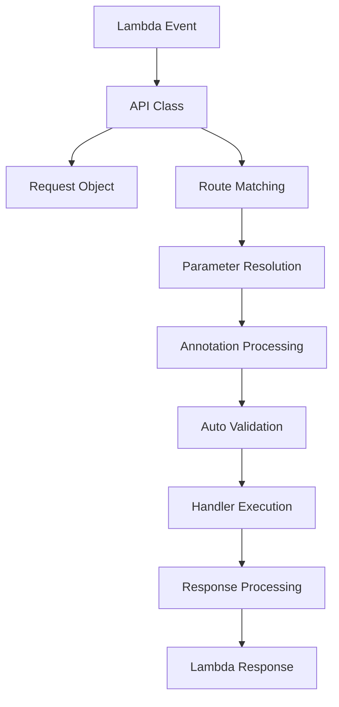

# 基本概念

lambapi の設計思想とアーキテクチャについて説明します。これらの概念を理解することで、より効果的に lambapi を活用できます。

## 設計原則

### 1. 統一性

lambapi v0.2.x は **統合アノテーションシステム** により、すべてのパラメータタイプを統一的に処理します。

```python
from lambapi import API, create_lambda_handler
from lambapi.annotations import Body, Path, Query, CurrentUser

def create_app(event, context):
    app = API(event, context)

    # すべてのパラメータが同じ方式で処理される
    @app.post("/users/{user_id}/posts")
    def create_post(
        user_id: int = Path(),
        post_data: PostModel = Body(),
        version: str = Query(default="v1"),
        current_user: User = CurrentUser()
    ):
        return {"created": "success"}

    return app
```

### 2. FastAPI 風の直感性

**自動推論機能** により、FastAPI と同じような直感的な記法を提供：

```python
# 型アノテーションから自動的にパラメータソースを判定
@app.get("/users/{user_id}")
def get_user(user_id: int):  # 自動的に Path パラメータ
    return {"id": user_id}

@app.post("/users")
def create_user(user: UserModel):  # 自動的に Body パラメータ
    return {"message": "Created", "user": user}
```

### 3. 型安全性とバリデーション

Pydantic モデルとデータクラスによる **自動バリデーション** を提供：

```python
from dataclasses import dataclass
from typing import Optional

@dataclass
class User:
    name: str
    email: str
    age: Optional[int] = None

@app.post("/users")
def create_user(user: User):  # 自動バリデーション・型変換
    return {"user": user}
```

### 4. パフォーマンス

Lambda の **cold start** を最小化するため、以下の最適化を行っています：

- 外部依存なし（Pydantic は Optional）
- 遅延読み込み
- キャッシュの活用
- 軽量なルーティング

## アーキテクチャ

### コア構成要素



### 1. 統合アノテーションシステム

v0.2.x の核となる機能で、すべてのパラメータタイプを統一的に処理：

```python
from lambapi.annotations import (
    Body,        # リクエストボディ
    Path,        # パスパラメータ
    Query,       # クエリパラメータ
    Header,      # HTTP ヘッダー
    CurrentUser, # 認証済みユーザー
    RequireRole, # ロール制限
    OptionalAuth # オプショナル認証
)
```

**処理フロー**:
1. 関数シグネチャを解析
2. 各パラメータのアノテーションを判定
3. 対応するリゾルバーでパラメータを取得
4. 型変換とバリデーションを実行

### 2. 自動推論エンジン

明示的なアノテーションがない場合の自動判定：

```python
def _resolve_parameter_automatically(param_name, param_type, default_value):
    # Pydantic モデルまたはデータクラス → Body
    if is_pydantic_model(param_type) or is_dataclass(param_type):
        return "body"

    # パスに存在 → Path
    if param_name in path_params:
        return "path"

    # その他 → Query
    return "query"
```

### 3. 認証システムの統合

認証もパラメータの一種として統一的に処理：

```python
@app.get("/profile")
def get_profile(current_user: User = CurrentUser()):
    return {"user": current_user}

@app.delete("/admin/data")
def delete_data(admin: User = RequireRole(roles=["admin"])):
    return {"deleted": "success"}
```

## パラメータ解決システム

### アノテーションベースの解決

各アノテーションタイプ専用のリゾルバーが処理：

```python
def _resolve_annotation_parameter(param_name, param_type, annotation, request, path_params):
    if is_body_annotation(annotation):
        return _resolve_body_parameter(param_type, request)
    elif is_path_annotation(annotation):
        return _resolve_path_parameter(param_name, param_type, path_params)
    elif is_query_annotation(annotation):
        return _resolve_query_parameter(param_name, param_type, annotation, request)
    elif is_auth_annotation(annotation):
        return _resolve_auth_parameter(param_type, annotation, request)
```

### バリデーション統合

```python
def validate_and_convert(data, model_class):
    """Pydantic モデルとデータクラス両方をサポート"""
    if is_pydantic_model(model_class):
        return model_class.model_validate(data)
    elif is_dataclass(model_class):
        return _validate_dataclass(data, model_class)
    else:
        raise ValueError("Unsupported model type")
```

## ルーティングシステム

### 高性能ルートマッチング

```python
class API:
    def __init__(self):
        # O(1) 検索用の完全一致テーブル
        self._exact_routes: Dict[str, Dict[str, Route]] = {}
        # パラメータ付きルート用のリスト
        self._pattern_routes: Dict[str, List[Route]] = {}
```

### パスパターン処理

```python
def _compile_path_regex(self, path: str) -> re.Pattern:
    # {param} を名前付きグループに変換
    pattern = re.sub(r'\{(\w+)\}', r'(?P<\1>[^/]+)', path)
    return re.compile(f'^{pattern}$')

# 例: "/users/{id}/posts/{post_id}"
# → "^/users/(?P<id>[^/]+)/posts/(?P<post_id>[^/]+)$"
```

## エラーハンドリング

### 統一エラー処理

v0.2.x では認証エラーも含めて統一的に処理：

```python
def _resolve_auth_annotation(param_name, param_type, annotation, request):
    try:
        if is_current_user_annotation(annotation):
            return auth.get_authenticated_user(request)
        elif is_require_role_annotation(annotation):
            user = auth.get_authenticated_user(request)
            # ロールチェック...
            return user
    except AuthenticationError as e:
        # 統一エラーハンドリングに委譲
        raise e
```

### カスタムエラーハンドラー

```python
@app.error_handler(ValidationError)
def handle_validation_error(error, request, context):
    return Response({
        "error": "VALIDATION_ERROR",
        "message": error.message,
        "details": error.details
    }, status_code=400)
```

## レスポンス処理

### 自動レスポンス変換

```python
def _process_response(result, route, request):
    if isinstance(result, Response):
        return result
    elif isinstance(result, dict):
        return Response(result)
    elif hasattr(result, 'model_dump'):  # Pydantic
        return Response(result.model_dump())
    elif hasattr(result, '__dict__'):  # dataclass
        return Response(convert_to_dict(result))
    else:
        return Response({"result": result})
```

## パフォーマンス最適化

### アノテーション処理のキャッシュ

```python
# 関数シグネチャのキャッシュ
_SIGNATURE_CACHE: Dict[Callable, inspect.Signature] = {}

# バリデーション情報のキャッシュ
_FIELD_INFO_CACHE: Dict[Type, Dict[str, Any]] = {}

# 型ヒントのキャッシュ
_TYPE_HINTS_CACHE: Dict[Type, Dict[str, Type]] = {}
```

### 段階的処理

```python
def _call_handler_with_params(route, request, path_params):
    # 1. シグネチャ解析（キャッシュ利用）
    signature = _get_cached_signature(route.handler)

    # 2. パラメータ解決（並列処理可能）
    call_args = {}
    for param_name, param_info in signature.parameters.items():
        call_args[param_name] = _resolve_parameter(
            param_name, param_info, request, path_params
        )

    # 3. ハンドラー実行
    return route.handler(**call_args)
```

## 拡張性

### アノテーションの拡張

新しいアノテーションタイプを簡単に追加可能：

```python
class CustomAnnotation:
    def __init__(self, **kwargs):
        self.options = kwargs

def is_custom_annotation(annotation):
    return isinstance(annotation, CustomAnnotation)

# リゾルバーに追加
def _resolve_custom_annotation(param_name, param_type, annotation, request):
    # カスタム処理...
    pass
```

### ミドルウェアシステム

```python
def auth_middleware(request, response):
    # リクエスト前処理
    if request.path.startswith('/admin'):
        # 管理者認証チェック
        pass

    # レスポンス後処理
    if isinstance(response, Response):
        response.headers['X-Auth-Version'] = '2.0'

    return response

app.add_middleware(auth_middleware)
```

## まとめ

lambapi v0.2.x の核となる概念：

- **統合アノテーションシステム** - すべてのパラメータを統一処理
- **FastAPI 風自動推論** - 直感的で学習コストが低い
- **型安全なバリデーション** - Pydantic/dataclass 両対応
- **認証システム統合** - 認証もパラメータとして扱う
- **高性能ルーティング** - Lambda に最適化された設計
- **拡張性** - カスタムアノテーションで機能追加可能

これらの概念を理解して、次のステップに進みましょう：

- [チュートリアル](../tutorial/basic-api.md) - 実践的な使用方法
- [API リファレンス](../api/api.md) - 詳細な API 仕様
