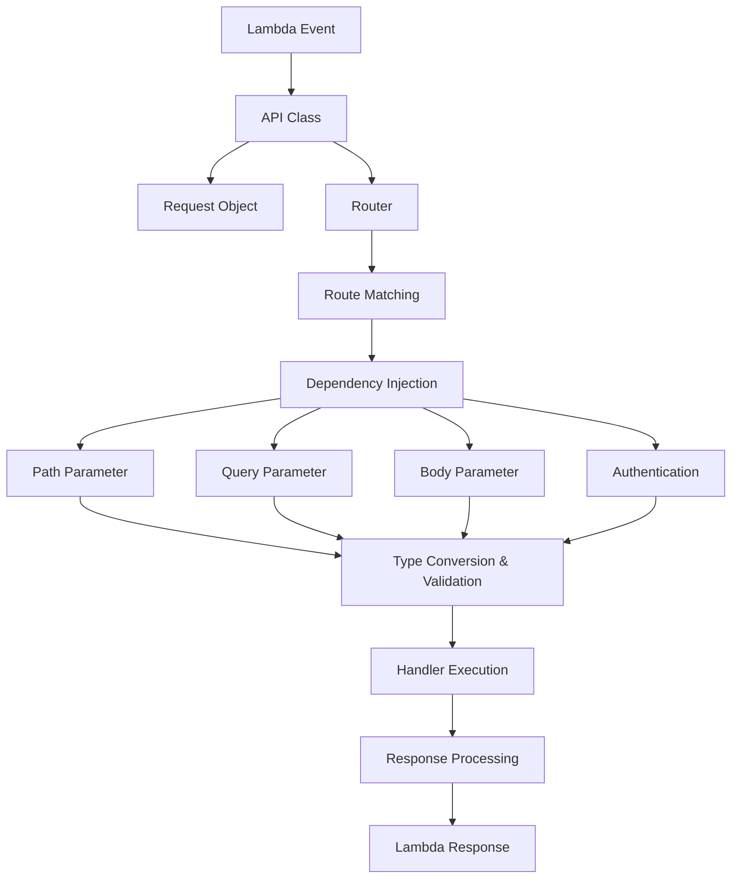

# 基本概念

lambapi の設計思想とアーキテクチャについて説明します。これらの概念を理解することで、より効果的に lambapi を活用できます。

## 設計原則

### 1. シンプリシティ

lambapi は **「設定より規約」** の原則に従い、最小限の設定で動作するように設計されています。

```python
# 複雑な設定は不要
from lambapi import API, create_lambda_handler

def create_app(event, context):
    app = API(event, context)

    @app.get("/users/{id}")
    def get_user(id: str):
        return {"id": id}

    return app
```

### 2. パフォーマンス

Lambda の **cold start** を最小化するため、以下の最適化を行っています：

- 外部依存なし
- 遅延読み込み
- キャッシュの活用
- 軽量なルーティング

### 3. 型安全性

Python の型ヒントを最大限活用し、IDE の支援とランタイムの安全性を両立：

```python
@app.get("/items")
def get_items(limit: int = 10, active: bool = True) -> dict:
    # IDE が型を推論し、ランタイムで自動変換
    return {"limit": limit, "active": active}
```

## アーキテクチャ

### コア構成要素



### 1. API クラス

すべての機能の中心となるクラス：

```python
class API:
    def __init__(self, event, context):
        self.event = event      # Lambda イベント
        self.context = context  # Lambda コンテキスト
        self.routes = []        # ルート定義
```

**役割**:
- ルートの管理
- リクエストのディスパッチ
- ミドルウェアの実行
- エラーハンドリング

### 2. Request オブジェクト

Lambda イベントを使いやすい形に変換：

```python
class Request:
    @property
    def method(self) -> str:           # HTTP メソッド

    @property
    def path(self) -> str:             # リクエストパス

    @property
    def query_params(self) -> dict:    # クエリパラメータ

    @property
    def headers(self) -> dict:         # ヘッダー

    def json(self) -> dict:            # JSON ボディ
```

### 3. Route システム

**Route クラス**がパスマッチングとパラメータ抽出を担当：

```python
class Route:
    def __init__(self, path: str, method: str, handler: callable):
        self.path_regex = self._compile_path_regex(path)

    def match(self, path: str, method: str) -> Optional[dict]:
        # パスマッチング + パラメータ抽出
        pass
```

## 依存性注入システム

### モダンな依存性注入

lambapi の最大の特徴は、モダンな依存性注入システムによる型安全なパラメータ取得です：

```python
from lambapi import Query, Path, Body
from dataclasses import dataclass

@dataclass
class UserFilter:
    name: str
    active: bool = True

@app.get("/users/{user_id}/posts")
def get_posts(
    user_id: str = Path(..., description="ユーザー ID"),           # パスパラメータ
    limit: int = Query(10, ge=1, le=100, description="取得件数"),   # クエリパラメータ
    sort: str = Query("date", regex="^(date|name|score)$"),      # バリデーション付き
    filters: UserFilter = Body(...)                              # リクエストボディ
):
    return {"user_id": user_id, "limit": limit, "sort": sort, "filters": filters}
```

### 依存性注入の種類

1. **Path()** - パスパラメータ (`/users/{user_id}`)
2. **Query()** - クエリパラメータ (`?limit=20&sort=name`)
3. **Body()** - リクエストボディ（JSON）
4. **Authenticated()** - 認証されたユーザー情報

### バリデーション機能

```python
from lambapi import Query, Path

@app.get("/users/{user_id}")
def get_user(
    user_id: int = Path(..., gt=0, le=999999, description="ユーザー ID"),
    name: str = Query(..., min_length=2, max_length=50, description="検索名"),
    active: bool = Query(True, description="アクティブフラグ"),
    score: float = Query(0.0, ge=0.0, le=100.0, description="スコア")
):
    # すべてのパラメータは型変換・バリデーション済み
    return {"user_id": user_id, "name": name, "active": active, "score": score}

# 利用可能なバリデーター
# - gt, ge, lt, le: 数値範囲
# - min_length, max_length: 文字列長
# - regex: 正規表現パターン
```

## ルーティングシステム

### パスパターン

lambapi は **Express.js 風** のパスパターンを使用：

```python
# 基本パス
@app.get("/users")

# パスパラメータ
@app.get("/users/{id}")

# 複数のパスパラメータ
@app.get("/users/{user_id}/posts/{post_id}")

# ネストしたルート
@app.get("/api/v1/users/{id}")
```

### 正規表現コンパイル

```python
def _compile_path_regex(self, path: str) -> re.Pattern:
    # {param} を名前付きグループに変換
    pattern = re.sub(r'\{(\w+)\}', r'(?P<\1>[^/]+)', path)
    return re.compile(f'^{pattern}$')

# 例: "/users/{id}" → "^/users/(?P<id>[^/]+)$"
```

## ミドルウェアシステム

### 実行順序

```python
Request → Middleware 1 → Middleware 2 → Handler → Middleware 2 → Middleware 1 → Response
```

### ミドルウェアの実装

```python
def cors_middleware(request, response):
    # リクエストの前処理（任意）

    # レスポンスの後処理
    if isinstance(response, Response):
        response.headers.update({
            'Access-Control-Allow-Origin': '*'
        })

    return response

app.add_middleware(cors_middleware)
```

## エラーハンドリング

### 階層的エラー処理


### エラーハンドラーの登録

```python
from lambapi import ErrorHandler

error_handler = ErrorHandler()

@error_handler.catch(ValidationError)
def handle_validation_error(error, request, context):
    return Response({
        "error": "VALIDATION_ERROR",
        "message": error.message,
        "field": error.field
    }, status_code=400)

app.add_error_handler(error_handler)
```

## レスポンス処理

### 自動レスポンス変換

ハンドラーの戻り値は自動的に適切な形式に変換されます：

```python
# 辞書 → JSON レスポンス
return {"message": "OK"}

# Response オブジェクト → そのまま使用
return Response(data, status_code=201)

# その他 → {"result": value} の形式
return "simple string"
```

### Lambda レスポンス形式

最終的に Lambda 用の形式に変換：

```python
{
    "statusCode": 200,
    "headers": {
        "Content-Type": "application/json"
    },
    "body": '{"message": "OK"}'
}
```

## パフォーマンス最適化

### キャッシュシステム

```python
# 関数シグネチャのキャッシュ
_SIGNATURE_CACHE: Dict[Callable, inspect.Signature] = {}

# 型変換関数のキャッシュ
_TYPE_CONVERTER_CACHE: Dict[Type, Callable] = {}

# フィールド情報のキャッシュ（バリデーション用）
_FIELD_INFO_CACHE: Dict[Type, Dict[str, Any]] = {}
```

### 遅延読み込み

```python
# モジュールは必要時にのみインポート
def _get_validation_module():
    if not hasattr(_get_validation_module, '_module'):
        from . import validation
        _get_validation_module._module = validation
    return _get_validation_module._module
```

## 拡張性

### プラグインシステム

lambapi は以下の方法で拡張できます：

1. **ミドルウェア** - リクエスト/レスポンス処理
2. **エラーハンドラー** - カスタム例外処理
3. **バリデーター** - 入力検証
4. **シリアライザー** - レスポンス変換

### Router 統合

```python
# 複数のルーターを組み合わせ
user_router = Router(prefix="/users")
admin_router = Router(prefix="/admin")

app.add_router(user_router)
app.add_router(admin_router)
```

## まとめ

lambapi の核となる概念：

- **モダンな依存性注入** - Query, Path, Body, Authenticated による型安全なパラメータ取得
- **自動型変換・バリデーション** - データクラスと制約による堅牢な API
- **軽量ルーティング** - 高速なパスマッチング
- **階層的エラー処理** - 柔軟で統一的なエラーハンドリング
- **ミドルウェアシステム** - 横断的関心事の分離
- **パフォーマンス最適化** - Lambda に特化した設計とキャッシュ機能

**従来システムとの互換性**: 新しい依存性注入システムを使いつつ、従来の `request` オブジェクトも並行して利用できます。

これらの概念を理解して、次のステップに進みましょう：

- [依存性注入チュートリアル](../tutorial/dependency-injection.md) - 詳細な依存性注入パターン
- [基本 API チュートリアル](../tutorial/basic-api.md) - 実践的な使用方法
- [認証システム](../guides/authentication.md) - DynamoDB + JWT 認証
- [API リファレンス](../api/api.md) - 詳細な API 仕様
