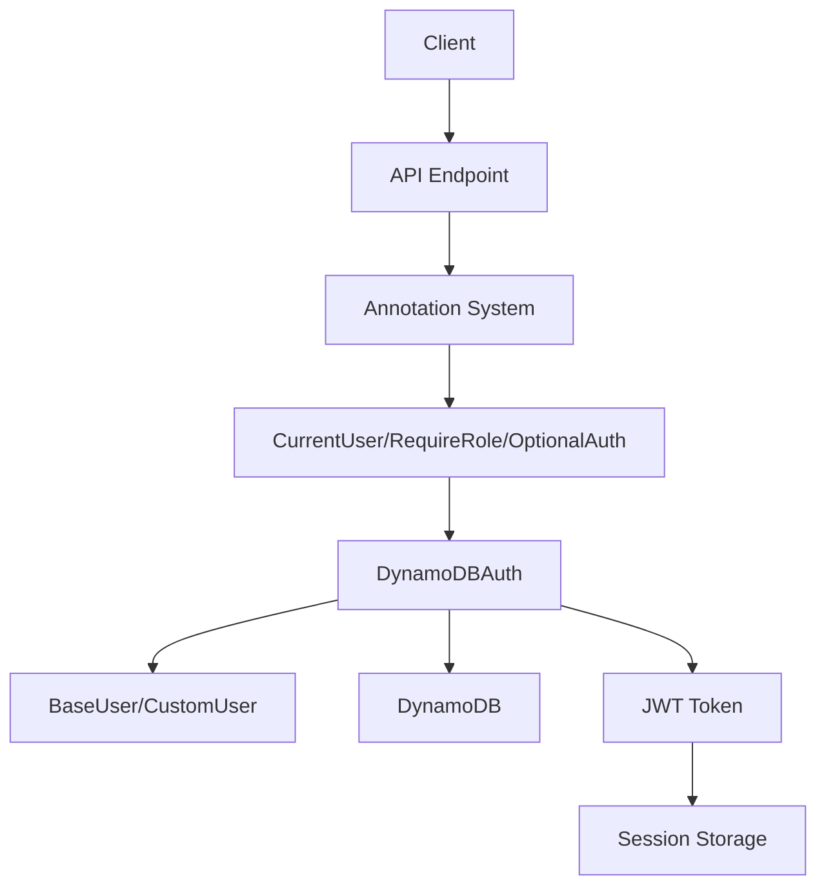

# 認証システム

lambapi v0.2.x では、認証システムも統合アノテーションシステムの一部として扱われます。DynamoDB を使用した JWT ベースの認証システムで、CurrentUser, RequireRole, OptionalAuth アノテーションにより、認証処理を簡潔に記述できます。

## 概要

### 特徴

- **統合アノテーションシステム**: 認証もパラメータの一種として扱う
- **JWT トークン認証**: セキュアなトークンベース認証
- **DynamoDB バックエンド**: AWS サービスとの完全統合
- **カスタマイズ可能**: BaseUser を継承してカスタムユーザーモデルを作成
- **ロールベース認証**: RequireRole アノテーションによる細かいアクセス制御
- **オプショナル認証**: OptionalAuth でログイン状態に応じた処理
- **セッション管理**: DynamoDB を使用した永続セッション
- **パスワード暗号化**: bcrypt による安全なハッシュ化

### v0.2.x の新機能

```python
# 従来の方式（削除済み）
@auth.require_role(["admin"])
@app.delete("/users/{user_id}")
def delete_user(request, user_id: str):
    pass

# 新しいアノテーション方式
@app.delete("/users/{user_id}")
def delete_user(
    user_id: str = Path(),
    admin_user: User = RequireRole(roles=["admin"])
):
    return {"deleted": user_id, "by": admin_user.name}
```

### アーキテクチャ



## インストール

認証機能を使用するには、オプショナル依存関係をインストールします：

```bash
pip install lambapi[auth]
```

必要な依存関係：
- `boto3>=1.28.0` - DynamoDB 接続
- `PyJWT>=2.8.0` - JWT トークン処理
- `bcrypt>=4.0.0` - パスワードハッシュ化
- `cryptography>=41.0.0` - 暗号化サポート

## 基本的な使用方法

### 1. シンプルな認証システム

```python
from lambapi import API, create_lambda_handler
from lambapi.annotations import CurrentUser, RequireRole, OptionalAuth
from lambapi.auth import BaseUser, DynamoDBAuth
from dataclasses import dataclass
from typing import Optional

@dataclass
class User(BaseUser):
    name: str
    email: str
    role: str = "user"

def create_app(event, context):
    app = API(event, context)

    # 認証システムの初期化
    auth = DynamoDBAuth(
        table_name="users",
        user_model=User,
        secret_key="your-secure-secret-key",  # 環境変数推奨
        region_name="ap-northeast-1"
    )
    app.include_auth(auth)

    # 認証が必要なエンドポイント
    @app.get("/profile")
    def get_profile(current_user: User = CurrentUser()):
        return {
            "id": current_user.id,
            "name": current_user.name,
            "email": current_user.email,
            "role": current_user.role
        }

    # ロール制限付きエンドポイント
    @app.delete("/admin/users/{user_id}")
    def delete_user(
        user_id: str = Path(),
        admin_user: User = RequireRole(roles=["admin"])
    ):
        return {
            "message": f"User {user_id} deleted",
            "deleted_by": admin_user.name
        }

    # オプショナル認証
    @app.get("/posts")
    def get_posts(user: Optional[User] = OptionalAuth()):
        if user:
            return {
                "posts": f"personalized for {user.name}",
                "user_role": user.role
            }
        return {"posts": "public content"}

    return app

lambda_handler = create_lambda_handler(create_app)
```

### 2. 複数ロール制限

```python
@app.post("/admin/reports")
def create_report(
    report_data: ReportRequest,  # 自動推論：Body パラメータ
    admin_user: User = RequireRole(roles=["admin", "manager"])
):
    """管理者またはマネージャーのみ実行可能"""
    return {
        "message": "Report created",
        "created_by": admin_user.name,
        "user_role": admin_user.role
    }

@app.get("/super-admin/system")
def get_system_info(
    super_admin: User = RequireRole(roles=["super_admin"])
):
    """スーパー管理者のみ実行可能"""
    return {
        "system_info": "sensitive data",
        "accessed_by": super_admin.name
    }
```

### 3. 混合認証パターン

```python
@app.put("/posts/{post_id}")
def update_post(
    post_id: str = Path(),
    post_data: UpdatePostRequest = Body(),
    current_user: User = CurrentUser(),
    version: str = Query(default="v1")
):
    """投稿を更新（認証必須）"""
    # 投稿の所有者チェックまたは管理者権限チェック
    if current_user.role not in ["admin", "moderator"]:
        # 所有者チェックのロジック
        pass

    return {
        "message": "Post updated",
        "post_id": post_id,
        "updated_by": current_user.name,
        "version": version
    }

@app.get("/posts/{post_id}/comments")
def get_comments(
    post_id: str = Path(),
    user: Optional[User] = OptionalAuth(),
    include_private: bool = Query(default=False)
):
    """コメント取得（認証オプショナル）"""
    comments = get_comments_by_post_id(post_id)

    # 認証済みユーザーの場合は追加情報を含める
    if user:
        comments = add_user_specific_info(comments, user)

        # プライベートコメントも含める（ロール制限）
        if include_private and user.role in ["admin", "moderator"]:
            comments.extend(get_private_comments(post_id))

    return {
        "post_id": post_id,
        "comments": comments,
        "viewer": user.name if user else "anonymous",
        "total": len(comments)
    }
```

## カスタムユーザーモデル

### データクラス版

```python
from dataclasses import dataclass
from lambapi.auth import BaseUser
from typing import Optional, List
from datetime import datetime

@dataclass
class CustomUser(BaseUser):
    name: str
    email: str
    role: str = "user"
    profile: Optional[dict] = None
    permissions: Optional[List[str]] = None
    last_login: Optional[str] = None
    created_at: Optional[str] = None

    def __post_init__(self):
        super().__post_init__()
        if self.created_at is None:
            self.created_at = datetime.now().isoformat()

    def has_permission(self, permission: str) -> bool:
        """カスタム権限チェック"""
        if self.role == "admin":
            return True
        return self.permissions and permission in self.permissions

# 使用例
def create_app(event, context):
    app = API(event, context)

    auth = DynamoDBAuth(
        table_name="custom_users",
        user_model=CustomUser,
        secret_key=os.environ["LAMBAPI_SECRET_KEY"],
        region_name="ap-northeast-1"
    )
    app.include_auth(auth)

    @app.get("/dashboard")
    def get_dashboard(user: CustomUser = CurrentUser()):
        return {
            "dashboard": f"Welcome {user.name}",
            "role": user.role,
            "permissions": user.permissions,
            "profile": user.profile,
            "last_login": user.last_login
        }

    @app.post("/admin/permissions")
    def manage_permissions(
        permission_data: PermissionRequest,
        admin: CustomUser = RequireRole(roles=["admin"])
    ):
        """権限管理（管理者のみ）"""
        return {
            "message": "Permissions updated",
            "updated_by": admin.name,
            "data": permission_data
        }
```

### Pydantic 版

```python
try:
    from pydantic import BaseModel, field_validator, EmailStr

    class PydanticUser(BaseUser, BaseModel):
        name: str
        email: EmailStr
        role: str = "user"
        profile: Optional[dict] = None
        permissions: Optional[List[str]] = None

        @field_validator('role')
        @classmethod
        def validate_role(cls, v):
            allowed_roles = ["user", "admin", "moderator", "super_admin"]
            if v not in allowed_roles:
                raise ValueError(f'Role must be one of: {allowed_roles}')
            return v

        @field_validator('email')
        @classmethod
        def validate_email_format(cls, v):
            # 追加のメール検証ロジック
            return v.lower()

    def create_app(event, context):
        app = API(event, context)

        auth = DynamoDBAuth(
            table_name="pydantic_users",
            user_model=PydanticUser,
            secret_key=os.environ["LAMBAPI_SECRET_KEY"]
        )
        app.include_auth(auth)

        @app.get("/profile")
        def get_profile(user: PydanticUser = CurrentUser()):
            return user.model_dump()  # Pydantic のシリアライゼーション

        return app

except ImportError:
    # Pydantic が利用できない場合
    PydanticUser = None
```

## 認証フロー

### 1. ユーザー登録とログイン

```python
@dataclass
class SignupRequest:
    name: str
    email: str
    password: str
    role: str = "user"

@dataclass
class LoginRequest:
    email: str
    password: str

def create_app(event, context):
    app = API(event, context)

    auth = DynamoDBAuth(
        table_name="users",
        user_model=User,
        secret_key=os.environ["LAMBAPI_SECRET_KEY"]
    )
    app.include_auth(auth)

    # ユーザー登録
    @app.post("/auth/signup")
    def signup(request: SignupRequest):
        """ユーザー登録（自動推論：Body パラメータ）"""
        try:
            user = auth.create_user(
                user_id=request.email,  # メールを ID として使用
                password=request.password,
                name=request.name,
                email=request.email,
                role=request.role
            )
            return {
                "message": "User created successfully",
                "user_id": user.id
            }
        except ValueError as e:
            return Response({"error": str(e)}, status_code=400)

    # ログイン
    @app.post("/auth/login")
    def login(request: LoginRequest):
        """ユーザーログイン"""
        try:
            token = auth.authenticate_user(
                user_id=request.email,
                password=request.password
            )
            return {
                "message": "Login successful",
                "access_token": token,
                "token_type": "bearer"
            }
        except ValueError as e:
            return Response({"error": str(e)}, status_code=401)

    # ログアウト
    @app.post("/auth/logout")
    def logout(current_user: User = CurrentUser()):
        """ログアウト"""
        auth.revoke_user_token(current_user.id)
        return {"message": "Logout successful"}

    # プロフィール更新
    @app.put("/profile")
    def update_profile(
        profile_data: UpdateProfileRequest,
        current_user: User = CurrentUser()
    ):
        """プロフィール更新"""
        # ユーザー情報の更新ロジック
        current_user.name = profile_data.name
        current_user.email = profile_data.email

        auth.update_user(current_user)

        return {
            "message": "Profile updated",
            "user": {
                "id": current_user.id,
                "name": current_user.name,
                "email": current_user.email
            }
        }
```

## エラーハンドリング

### カスタム認証エラーハンドラー

```python
from lambapi.exceptions import AuthenticationError, AuthorizationError

def create_app(event, context):
    app = API(event, context)

    # 認証エラーのカスタムハンドラー
    @app.error_handler(AuthenticationError)
    def handle_auth_error(error, request, context):
        return Response({
            "error": "AUTHENTICATION_ERROR",
            "message": "認証が必要です",
            "details": str(error)
        }, status_code=401)

    @app.error_handler(AuthorizationError)
    def handle_authz_error(error, request, context):
        return Response({
            "error": "AUTHORIZATION_ERROR",
            "message": "権限が不足しています",
            "details": str(error)
        }, status_code=403)

    # 認証設定
    auth = DynamoDBAuth(
        table_name="users",
        user_model=User,
        secret_key=os.environ["LAMBAPI_SECRET_KEY"]
    )
    app.include_auth(auth)

    return app
```

## テスト

### 認証システムのテスト

```python
import json
import jwt
import pytest
from app import lambda_handler

class TestAuthentication:
    def test_current_user_annotation(self):
        """CurrentUser アノテーションのテスト"""
        # まずユーザーを作成してログイン
        signup_event = {
            'httpMethod': 'POST',
            'path': '/auth/signup',
            'body': json.dumps({
                'name': 'Test User',
                'email': 'test@example.com',
                'password': 'password123'
            }),
            'headers': {'Content-Type': 'application/json'}
        }

        result = lambda_handler(signup_event, None)
        assert result['statusCode'] == 200

        # ログイン
        login_event = {
            'httpMethod': 'POST',
            'path': '/auth/login',
            'body': json.dumps({
                'email': 'test@example.com',
                'password': 'password123'
            }),
            'headers': {'Content-Type': 'application/json'}
        }

        login_result = lambda_handler(login_event, None)
        login_body = json.loads(login_result['body'])
        token = login_body['access_token']

        # 認証が必要なエンドポイントにアクセス
        profile_event = {
            'httpMethod': 'GET',
            'path': '/profile',
            'headers': {
                'Authorization': f'Bearer {token}',
                'Content-Type': 'application/json'
            }
        }

        profile_result = lambda_handler(profile_event, None)
        assert profile_result['statusCode'] == 200

        profile_body = json.loads(profile_result['body'])
        assert profile_body['name'] == 'Test User'

    def test_require_role_annotation(self):
        """RequireRole アノテーションのテスト"""
        # 管理者ユーザーでログイン（事前にセットアップ）
        admin_token = create_admin_token()  # ヘルパー関数

        delete_event = {
            'httpMethod': 'DELETE',
            'path': '/admin/users/test-user-id',
            'headers': {
                'Authorization': f'Bearer {admin_token}',
                'Content-Type': 'application/json'
            }
        }

        result = lambda_handler(delete_event, None)
        assert result['statusCode'] == 200

    def test_optional_auth_annotation(self):
        """OptionalAuth アノテーションのテスト"""
        # 認証なしでアクセス
        public_event = {
            'httpMethod': 'GET',
            'path': '/posts',
            'headers': {'Content-Type': 'application/json'}
        }

        result = lambda_handler(public_event, None)
        assert result['statusCode'] == 200

        body = json.loads(result['body'])
        assert body['posts'] == 'public content'

        # 認証ありでアクセス
        token = create_user_token()  # ヘルパー関数
        auth_event = {
            'httpMethod': 'GET',
            'path': '/posts',
            'headers': {
                'Authorization': f'Bearer {token}',
                'Content-Type': 'application/json'
            }
        }

        auth_result = lambda_handler(auth_event, None)
        auth_body = json.loads(auth_result['body'])
        assert 'personalized' in auth_body['posts']
```

## デプロイメント

### DynamoDB テーブル設定

```yaml
# CloudFormation/SAM template
Resources:
  UsersTable:
    Type: AWS::DynamoDB::Table
    Properties:
      TableName: !Sub "${Environment}-users"
      BillingMode: PAY_PER_REQUEST
      AttributeDefinitions:
        - AttributeName: id
          AttributeType: S
        - AttributeName: email
          AttributeType: S
      KeySchema:
        - AttributeName: id
          KeyType: HASH
      GlobalSecondaryIndexes:
        - IndexName: email-index
          KeySchema:
            - AttributeName: email
              KeyType: HASH
          Projection:
            ProjectionType: ALL
      StreamSpecification:
        StreamViewType: NEW_AND_OLD_IMAGES
```

### 環境変数設定

```bash
# 本番環境での環境変数
export LAMBAPI_SECRET_KEY="your-very-secure-secret-key-here"
export DYNAMODB_TABLE_NAME="prod-users"
export AWS_DEFAULT_REGION="ap-northeast-1"
```

## まとめ

lambapi v0.2.x の認証システムの特徴：

### 🎯 主な利点

1. **統合アノテーションシステム**
   - 認証もパラメータの一種として扱う
   - 一貫した API デザイン

2. **簡潔な記法**
   - `CurrentUser()`, `RequireRole()`, `OptionalAuth()`
   - 従来のデコレータ地獄を解消

3. **型安全性**
   - User オブジェクトの型が保証される
   - IDE の支援を受けられる

4. **柔軟性**
   - データクラスと Pydantic 両対応
   - カスタムユーザーモデルに対応

### 🚀 次のステップ

- [デプロイメント](deployment.md) - 本番環境での運用
- [API リファレンス](../api/api.md) - 詳細な API 仕様
